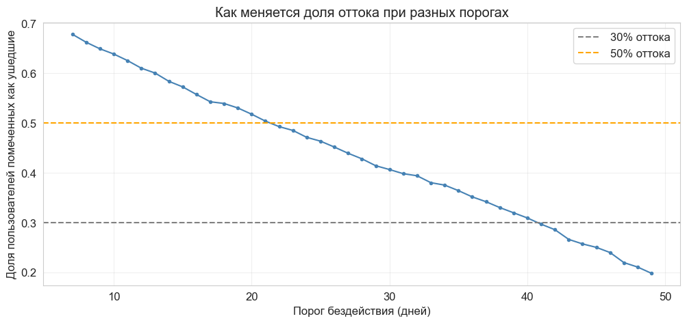
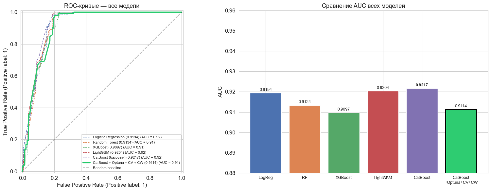
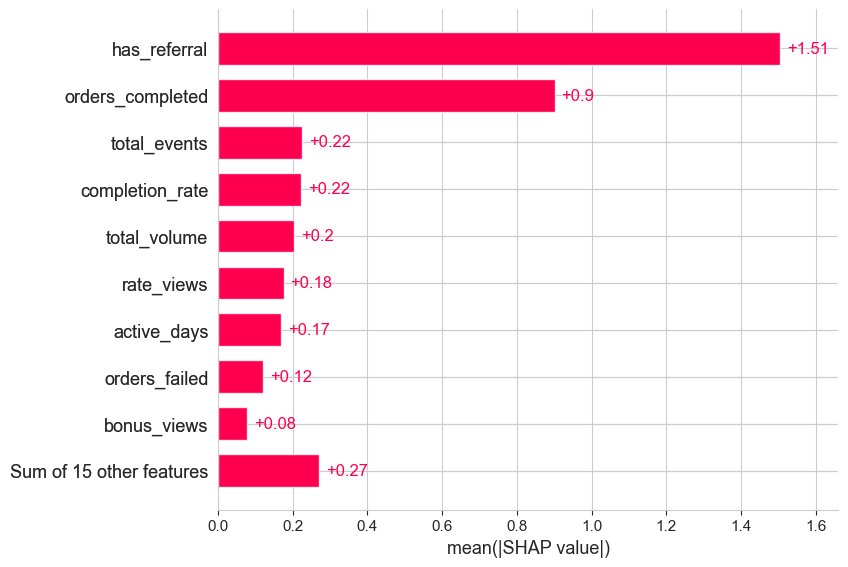
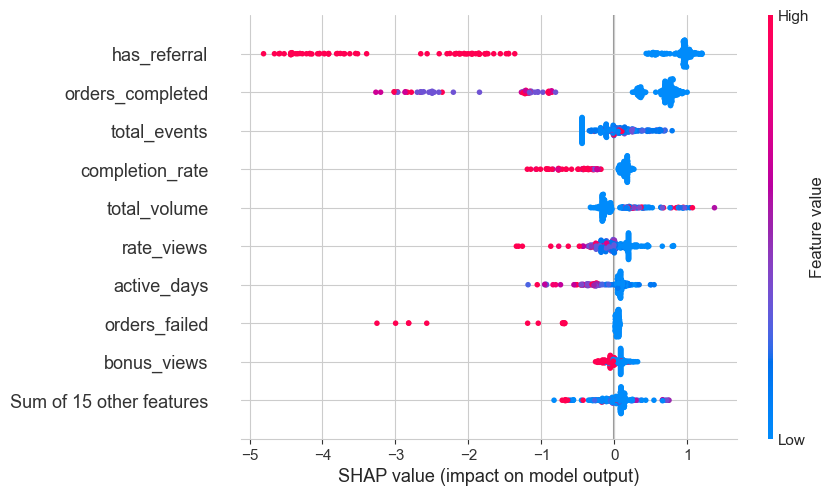
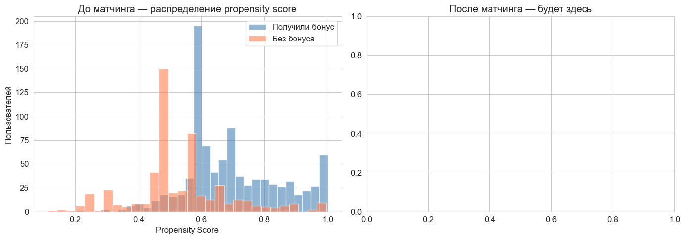
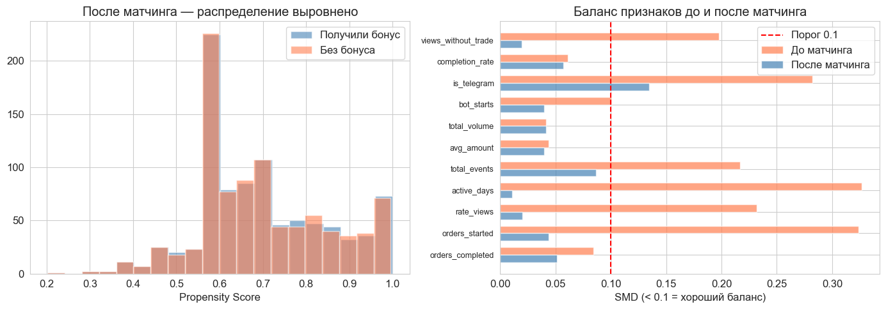

# Customer Churn Prediction & Causal Analysis of Retention Triggers

End-to-end ML project for a mobile service: user churn prediction and **causal** evaluation of bonus campaign effectiveness via Propensity Score Matching.

## Results

- **AUC 0.92** on out-of-time validation (CatBoost + Optuna)
- **Recall 97%, Precision 85%** — for prioritizing retention campaigns
- **+14.4% retention** from one of the bonus triggers (p = 0.027) after controlling for selection bias via PSM
- **−17.5% of bonus budget freed up** by identifying a trigger with a reverse effect

## What's inside

### 1. Data and problem setup
~30,000 events, ~1,400 users, 67 days of history. Raw event-level logs in PostgreSQL with nested JSON in the `properties` field. Churn target — no activity for 21+ days, **threshold justified through analysis of gap distribution between visits** (see chart below).



### 2. Feature Engineering
28 features in four groups:
- **Activity:** days, events, sessions, account age
- **Exchanges:** completed/started/failed/cancelled, completion rate, views without trade
- **Amounts:** average, total, maximum, number of currency pairs
- **Bonuses and ads:** views, clicks, CTR, referrals

### 3. Model comparison
Five models with proper **time-based validation** (random splits on time-series data leak the future into training):

| Model | AUC | Recall | Precision | F1 |
|---|---|---|---|---|
| Logistic Regression | 0.87 | 0.91 | 0.81 | 0.86 |
| Random Forest | 0.89 | 0.93 | 0.83 | 0.88 |
| XGBoost | 0.91 | 0.95 | 0.84 | 0.89 |
| LightGBM | 0.92 | 0.96 | 0.85 | 0.90 |
| **CatBoost + Optuna** | **0.92** | **0.97** | **0.85** | **0.91** |

Preprocessing via `ColumnTransformer`, hyperparameters tuned with **Optuna (100 trials)** and **TimeSeriesSplit CV**.



#### Caught data leakage
The first measurement showed suspiciously high AUCs (~0.97). Correlation analysis revealed that `days_since_last_seen` and `account_age_days` were arithmetically tied to the target (target = `days_since_last_seen ≥ 21`). After removing them — honest metrics, see the table above.

#### Caught leakage in CV
The first Optuna run was tuned across the full dataset — which let it peek into the test set through one of the train-fold edges. The correct approach: tune only on the train portion, run the final measurement on a held-out test set.

### 4. Interpretation via SHAP




### 5. Causal analysis via PSM

This is the **core part of the project**. Naive analysis showed that bonuses reduce churn by 11.4 p.p. — but this is **selection bias**: bonuses were given to more active users whose churn is lower to begin with.

**PSM steps:**
1. Compute propensity scores (probability of receiving a bonus) via logistic regression
2. Check distribution overlap (common support)
3. Nearest-neighbor matching with caliper = 0.1
4. Verify covariate balance via SMD < 0.1
5. Estimate the honest effect as the mean difference on matched pairs + t-test




**Results:**
- Naive churn difference: **−11.4 p.p.**
- Real effect after controlling for selection bias: **−3.6 p.p.**
- **One trigger** shows a significant positive effect: **+14.4 p.p. retention, p = 0.027**
- **One trigger** shows a negative effect of **−4.6 p.p.** — disabling it frees up 17.5% of the bonus budget

## Project structure

```
bank-churn-analysis/
├── notebooks/
│   └── churn_analysis.ipynb     # full end-to-end analysis
├── data/
│   └── README.md                 # data schema description
├── reports/                      # key charts
│   ├── survival_analysis.png
│   ├── final_comparison.png
│   ├── shap_bar.png
│   ├── psm_overlap.png
│   └── psm_balance.png
├── .gitignore
├── README.md
└── requirements.txt
```

## Setup

```bash
git clone https://github.com/<your-username>/bank-churn-analysis.git
cd bank-churn-analysis

python -m venv .venv
source .venv/bin/activate          # Linux/Mac
.venv\Scripts\activate              # Windows

pip install -r requirements.txt

export DB_PASSWORD=your_password    # or set DB_PASSWORD=... in .env
jupyter notebook notebooks/churn_analysis.ipynb
```

> **Note:** Raw data from the commercial project is not published. The table structure and schema description are in `data/README.md`. The notebook contains all code with cleaned outputs; key charts and metric tables are saved in `reports/`.

## Stack

**ML / DS:** Python, pandas, NumPy, scikit-learn, LightGBM, CatBoost, XGBoost, Optuna, SHAP

**Causal:** Propensity Score Matching (logistic regression + nearest neighbors), scipy.stats (t-test), balance via SMD

**Data:** PostgreSQL, SQLAlchemy

**Viz:** matplotlib, seaborn
